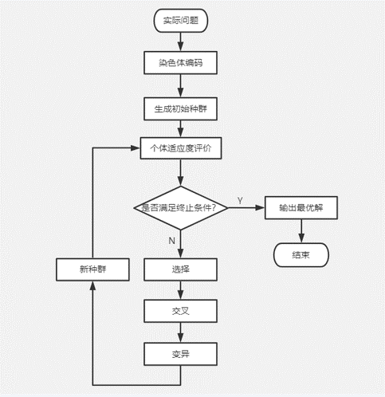
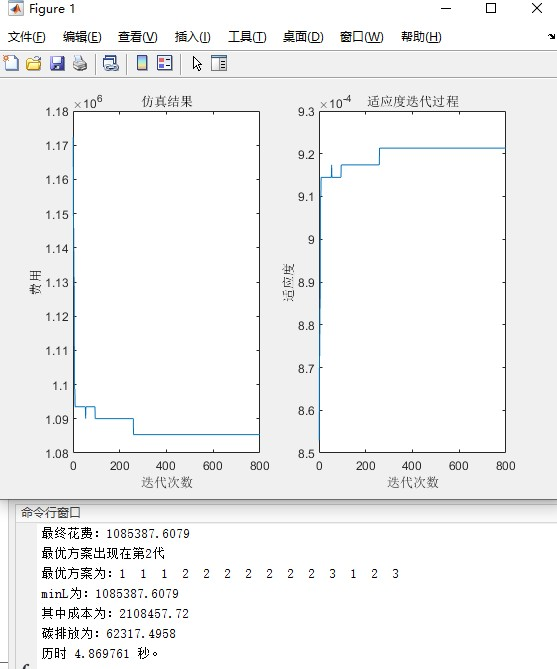

# GA_Logistic
这是一个利用Matalab设计关于物流网络选址的遗传算法

## 遗传算法介绍
		遗传算法(Genetic Algorithm)，又称为进化算法，于20世纪70年代由美国学者约翰.霍华德教授提出的，是一种根据达尔文自然选择模拟计划而得
	的计算模型，原理是通过模拟自然界生物进化规律的方式来寻求最优解。具体运行方式如下图所示。

## 主要关注的问题
	1、主要关注物流网络节点的选择和网络连接方式的确定，物流网络节点的选择主要包括销售中心的选择；网络连接方式的确定包括厂商与运输中心之间的连接、运输中心与销售中心的连接。 
	2、考虑的碳排放只考虑二氧化碳的排放在内，且只考虑运输过程中的排放，配送中心和销售中心的建立或其他方式所产生的二氧化碳不计算在内。
	3、在运输线上运用到了更加贴近现实的方案：生产厂商和配送中心之间的运输可以选择公路、铁路和水路三种运输方式，而配送中心与销售中心之间只允许采用公路运输方式完成配送；且一个销售中心的货物只能由一个配送中心提供。

## 各函数解释
        
	|—— main.m 主程序 
	
		|—— data.m  数据导入

		|—— initialization.m 初始化
			|—— decode.m 解码
			|—— fitness.m 计算适应度
    
		|—— iteration.m 迭代函数         
			|—— select.m 选择操作       
			|—— crossover.m 交叉互换操作     
			|—— mutation.m 变异操作

## 运行方式和运行结果
        本文运用matlab进行编程，具体操作只需要将整个文件添加到运行路径中，运行main.m程序即可,具体结果如下图。

